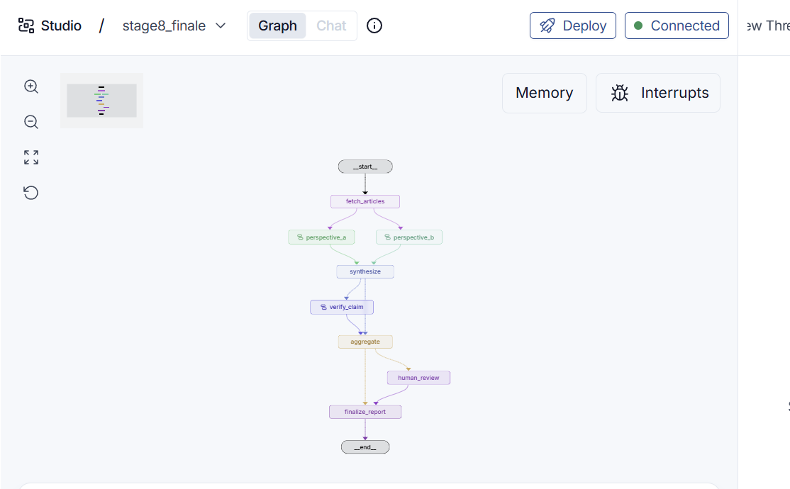

# LangGraph News Verifier

Learn [LangGraph](https://langchain-ai.github.io/langgraph/) by building a news-claim verification agent one concept at a time — from "what is a graph" all the way to a live, web-searching fact-checker.

## 📘 [Read the training guide →](docs/TRAINING-GUIDE.md)

**11 stages, written for people with no agent-framework background.** Each stage adds a single capability on top of the last, with the idea, the code, how to run it, and the pitfalls. Also available as a [PDF](docs/TRAINING-GUIDE.pdf) and [slides](docs/LangGraph-Project.pptx).



## What it does

Give the agent a news claim. It searches the web for supporting and contradicting evidence, weighs it, and returns a reasoned verdict — with persistent memory, human-in-the-loop overrides, and parallel verification along the way.

## The stages

Each stage is one `stageN_*.py` file. Click a row to jump straight into that section of the guide.

| Stage | File | What it teaches |
|-------|------|-----------------|
| [1](docs/TRAINING-GUIDE.md#stage-1--a-graph-that-makes-a-decision) | `stage1_basics.py` | A graph that makes a decision — nodes, edges, state |
| [2](docs/TRAINING-GUIDE.md#stage-2--memory-that-survives) | `stage2_checkpointer.py`, `stage2_inspect.py` | Memory that survives — checkpointers and inspecting saved state |
| [3](docs/TRAINING-GUIDE.md#stage-3--pausing-for-a-human) | `stage3_interrupt.py` | Pausing for a human — interrupts |
| [4](docs/TRAINING-GUIDE.md#stage-4--seeing-the-graph) | `studio_graph.py`, `langgraph.json` | Seeing the graph — visualizing it in LangGraph Studio |
| [5](docs/TRAINING-GUIDE.md#stage-5--two-readings-one-reusable-machine) | `stage5_subgraphs.py` | Two readings, one reusable machine — subgraphs |
| [6](docs/TRAINING-GUIDE.md#stage-6--the-agent-loop) | `stage6_verifier.py` | The agent loop — the claim-verification subgraph |
| [7](docs/TRAINING-GUIDE.md#stage-7--many-agents-at-once) | `stage7_fanout.py` | Many agents at once — fan-out / parallel execution |
| [8](docs/TRAINING-GUIDE.md#stage-8--escalate-only-what-is-uncertain) | `stage8_finale.py` | Escalate only what is uncertain — conditional routing |
| [9](docs/TRAINING-GUIDE.md#stage-9--giving-the-human-real-authority) | `stage9_human_override.py` | Giving the human real authority — overrides |
| [10](docs/TRAINING-GUIDE.md#stage-10--real-articles) | `stage10_real_articles.py` | Real articles — reasoning over fetched text |
| [11](docs/TRAINING-GUIDE.md#stage-11--real-evidence-fully-live) | `stage11_real_search.py` | Real evidence, fully live — web search via Tavily |

## Setup

```bash
python -m venv .venv
.venv\Scripts\activate          # Windows (use: source .venv/bin/activate on macOS/Linux)
pip install -r requirements.txt
```

Create a `.env` file with your keys (it's gitignored, so it never gets committed):

```
ANTHROPIC_API_KEY=sk-ant-...    # needed from Stage 5
TAVILY_API_KEY=tvly-...         # needed from Stage 10
LANGSMITH_API_KEY=lsv2_...      # optional, for tracing
```

Then run any stage:

```bash
python stage1_basics.py
```

Packages and keys are only needed from the stage that introduces them — you can start Stage 1 with nothing but `langgraph`. See the [guide's setup section](docs/TRAINING-GUIDE.md#4-environment-and-setup) for the full walkthrough, including the Windows Smart App Control note.

## Notes

- `.env`, `.venv/`, the `checkpoints*.sqlite` run state, and `__pycache__/` are gitignored.
- Windows-specific Smart App Control workaround lives in `sac_workaround/`.
